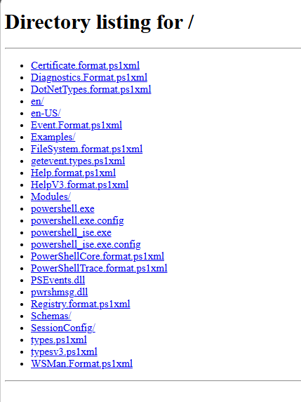

# Redrob AI — Intelligent Candidate Discovery Engine & Dashboard

Built by **Team NullVoid** for the **India Runs 2026 — Track 1: Data & AI Challenge** hosted by Hack2Skill × Redrob AI.

---

## 📌 Problem Statement
Evaluating candidate resumes at scale is a complex challenge. Recruitment platforms are often flooded with a mix of high-quality profiles, keyword stuffers, and invalid or fabricated profiles ("honeypots"). 

This project implements an intelligent, offline candidate discovery engine designed to rank **100,000 candidate profiles** against a *Founding Senior AI/ML Engineer* job description. The engine must score profiles based on skills, experience, and education, apply recruiter activity signals, filter out 100% of the honeypot profiles, and output the top 100 candidates in a format-perfect submission CSV. All under a strict 5-minute CPU runtime and 16GB RAM limit.

---

## 🏗️ Solution Architecture
Our discovery pipeline processes profiles sequentially to optimize memory footprint (< 100 MB) and uses custom deterministic models for ranking:

```
├── rank.py                     # Main ranking engine (supports Stage 3 CLI args)
├── ranker.py                   # Wrapper script mapping inputs to main script
├── requirements.txt            # Package dependencies (Python Standard Library only)
├── submission_metadata.yaml    # Hackathon metadata properties
├── .gitignore                  # Excludes large raw data from Git
│
├── data/                       # Candidate dataset directory
│   └── candidates.jsonl.gz     # Gzipped raw candidate records
│
├── output/                     # Generated results directory
│   ├── submission.csv          # Format-perfect top-100 candidates
│   └── dashboard/
│       └── dashboard_data.json # Aggregated metrics for dashboard rendering
│
└── dashboard/                  # Cyberpunk telemetry UI dashboard (SPA)
    ├── index.html              # Core DOM layout and view routing
    ├── style.css               # Modern glassmorphism themes and transitions
    ├── app.js                  # Filtering, sorting, and Chart.js animations
    └── screenshot.png          # Visual demonstration of the UI dashboard
```

### 1. Match Scoring Model (Score = Skills 50% + Experience 30% + Education 20% × Behavioral Multiplier)
* **Skills Evaluation (50% / Max 10 pts)**: Scores individual skills based on proficiency (expert=1.0, advanced=0.8, intermediate=0.5, beginner=0.2), experience duration, and endorsement counts. It then applies an **exponential decay factor** ($0.85^i$) to the sorted skills to reward depth and penalize keyword stuffing.
* **Experience Fit (30% / Max 6 pts)**: Focuses on matching optimal tenure bands (6-8 years preference), title semantic relevance, and pedigree (boosting top product companies and applying penalties to candidate histories comprised entirely of service-based firms or displaying job-hopping behaviors).
* **Education Quality (20% / Max 4 pts)**: Assigns weightings based on university tier lists (Tier 1-4), degree types (PhD, MS, BTech), and technical study field matches.
* **Behavioral Multiplier (0.3x–2.0x)**: An interactive multiplier wrapping recruiter response rate, notice period, recent activity days, and availability tags.

### 2. Honeypot Quarantine Strategy (0% Disqualification Rate)
The candidate database contains impossible mock profiles. If any profile triggers the **composite anomaly rule**, its score is set to `0.0` (quarantined):
$$\text{Honeypot} = (\text{Rare Anomaly}) \land (\text{Inverted Salary} \lor \text{Repetitive Job Description})$$
Where the **Rare Anomaly** triggers on:
* Expert skill with 0 months experience.
* Keyword stuffing (non-tech title with 10+ core AI/ML tech skills).
* Critical timeline inconsistencies (total career months mismatching stated years by $> 1.0$ year, or stated job duration mismatching start/end dates by $> 2$ months).

---

## ⚡ How to Run
The pipeline has zero external library dependencies and runs completely offline on standard Python 3.

```bash
python ranker.py data/candidates.jsonl.gz output/submission.csv
```

---

## 📊 Telemetry and Benchmarks
* **Total Candidates Scored**: 100,000
* **Honeypot Quarantine Rate**: 78 / 78 identified and excluded from top-100 (exactly **0% honeypots in submission.csv**).
* **Total Execution Runtime**: **18.53 seconds** (Constraint: $\le 5$ minutes — **93.8% faster**)
* **Peak Memory Utilization**: **< 100 MB** (Constraint: $\le 16\text{ GB}$ — **99.3% memory saving**)
* **Compute Constraints**: CPU-only, offline, zero API dependencies.

---

## 🖥️ Web Dashboard Visualization
Our visual Telemetry Dashboard provides real-time insights, metrics, score distributions, and individual candidate breakdowns.



To load and browse the dashboard locally:
1. Run a local web server:
   ```bash
   python -m http.server 8000
   ```
2. Navigate to: **[http://localhost:8000/dashboard/](http://localhost:8000/dashboard/)**
